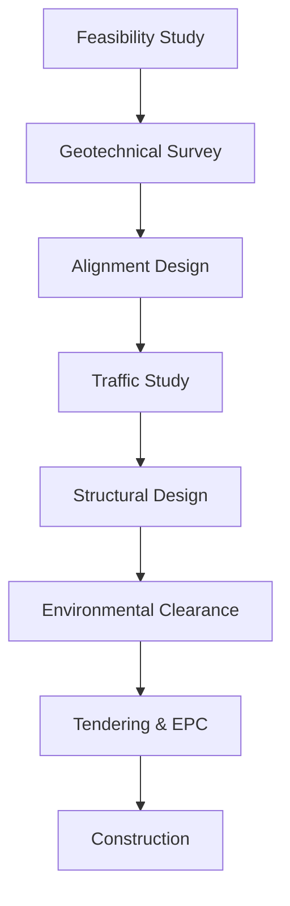
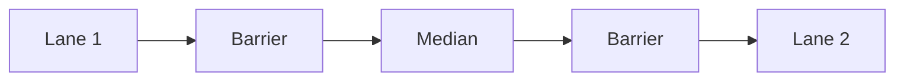

# Detailed Project Report (DPR): Proposed Elevated Corridor in Urban Area

## 1. Introduction

Urban areas in India are experiencing exponential traffic growth, resulting in congestion, pollution, and longer commutes. Elevated corridors offer a solution by creating grade-separated routes that bypass bottlenecks.

This **DPR** outlines the proposal for a **6.5 km elevated corridor** in a congested metro area to enhance mobility, improve traffic flow, and promote sustainable transport.

### Why It Matters
- Reduces congestion and travel time  
- Increases road capacity without ground-level land acquisition  
- Boosts productivity through efficient transport  
- Improves air quality by reducing idling  

### Who This DPR is For
- Urban planning authorities  
- Municipal corporations  
- Transport engineers  
- EPC contractors and consultants  
- Environmental regulators and funding agencies  

---

## 2. Key Terminology

- **Elevated Corridor**: Road constructed on pillars above ground  
- **Right of Way (RoW)**: Legal right to build infrastructure on land  
- **EPC**: Contractor responsible for Engineering, Procurement & Construction  
- **FSI**: Floor Space Index – development density  
- **Geotechnical Investigation**: Study of soil for foundation design  
- **Pier**: Vertical support element of the structure  
- **Ramp**: Slope that connects elevated road with ground  
- **LOS**: Level of Service – traffic performance grade (A–F)  

---

## 3. Technical Overview

### Project Summary

| Parameter            | Value                                  |
|----------------------|----------------------------------------|
| Total Length         | 6.5 km                                 |
| Carriageway Width    | 14.5 m                                 |
| No. of Lanes         | 4                                      |
| Vertical Clearance   | 5.5 m                                  |
| Structure Type       | Prestressed concrete segmental box girder |
| Foundation Type      | Pile foundation with cap and pier      |

### Design Workflow

## Software & Tools Used

- **AutoCAD Civil 3D**: Alignment and layout  
- **STAAD Pro**: Structural analysis  
- **MIDAS Civil**: Bridge and dynamic design  
- **QGIS**: Mapping and Right of Way (RoW) impact  
- **HDM-4**: Economic analysis and cost-benefit evaluation  

---

## 4. Step-by-Step Guide or Workflow

### 4.1 Feasibility and Pre-Planning

- **Traffic Volume Study**:  
  - Average Daily Traffic (ADT)  
  - Peak hour volume  
  - Vehicle classification (2W, 4W, commercial)

- **Topographic & Geotechnical Survey**:  
  - LIDAR, Total Station for mapping  
  - Boreholes for soil profile and bearing capacity  

- **Environmental & Social Impact Assessment (ESIA)**:  
  - Assess noise, vibration, and emissions  
  - Plan for resettlement and rehabilitation (R&R)

- **Alignment Design**:  
  - Define start and end points  
  - Integrate ramps, utilities, and drainage systems  

### 4.2 Detailed Engineering

- **Structural Design**:  
  - Span length: 30–35 m  
  - Box girder section  
  - Seismic and wind load compliance

- **Foundation**:  
  - Pile depth: 20–30 m  
  - Waterproofing and anti-scour layers

- **Utility Management**:  
  - Relocate water lines, sewer, telecom, and power cables  

### 4.3 Execution & Monitoring

- **Tendering**:  
  - Release RFP under EPC or HAM model  
  - Conduct pre-bid meetings for clarity

- **Construction Phases**:
  - **Phase I**: Foundation & piling  
  - **Phase II**: Pier erection  
  - **Phase III**: Girder launching and decking  

- **Traffic Diversion**:  
  - Pre-notification and public alerts  
  - Use signage, traffic marshals, and mobile apps  

- **Monitoring**:  
  - Drone-based inspections  
  - IoT sensors for real-time structural health monitoring  

---

## 5. Best Practices

- **Minimize Disruption**: Conduct night work in high-traffic areas  
- **Safety First**: Use PPE, barricading, and safety nets  
- **Use Precast Segments**: Speed up execution and ensure quality  
- **Engage Public**: Run awareness and outreach campaigns  
- **Green Design**: Install solar lighting and vertical gardens on piers  

---

## 6. Common Issues & Troubleshooting

| Problem                | Root Cause           | Solution                                 |
|------------------------|----------------------|------------------------------------------|
| Utility Shifting Delays| Poor coordination    | Form an inter-agency utility task force  |
| Cost Overrun           | Inflation, scope creep| Add 15% contingency in budget             |
| Ground Settlement      | Weak subsoil         | Use deep piles and ground improvements   |
| Traffic Chaos          | Inadequate planning  | Implement a robust traffic diversion plan|
| Environmental Opposition| No mitigation measures| Transparent ESIA and public consultation |

---

## 7. References

- IRC: SP: 96-2012 – Guidelines for Urban Elevated Roads  
- Ministry of Road Transport & Highways (MoRTH)  
- National Green Tribunal (NGT) Guidelines  
- PM Gati Shakti Infrastructure Portal  
- MoHUA – Urban Transport Planning Manual  

---

## 8. Appendix

### 8.1 Traffic Volume Forecast Table

| Year | Traffic Volume (PCU/day) | Expected LOS                          |
|------|---------------------------|----------------------------------------|
| 2025 | 45,000                    | D                                      |
| 2035 | 70,000                    | E                                      |
| 2045 | 90,000                    | F (Without Corridor) / C (With Corridor)|

### 8.2 Cross-Section Diagram (Mermaid)

